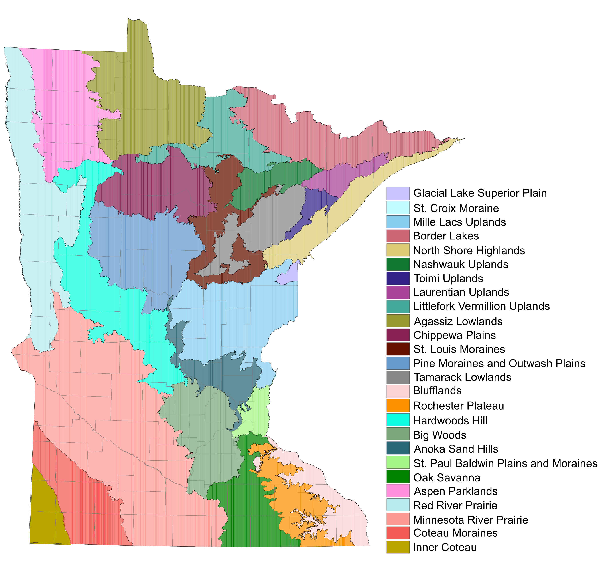

```{r setup, include=FALSE}
knitr::opts_chunk$set(echo = TRUE)
knitr::opts_chunk$set(message = FALSE)
knitr::opts_chunk$set(warning = FALSE)
knitr::opts_chunk$set(cache = FALSE)
```


```{r}
#Libraries
library(adegenet)
library(vcfR)
library(poppr)
library(ape)
library(viridis)
library(wordcloud)
library(sp)
library(rgdal)
library(spdep)
library(adespatial)
library(rgeos)
library(maps)
library(maptools)
library(ggplot2)
library(pals)
library(rcartocolor)
library(dbscan)
library(plotly)
library(gg3D)
library(akima)
library(vegan)
library(hierfstat)
library(pegas)
library(dplyr)
library(tidyr)
library(graph4lg)
library(raster)
library(groc)
library(qvalue)
library(conStruct)
library(fields)
library(gridExtra)
library(magick)
library(pdftools)
library(leaflet)
library(scatterplot3d)
library(ggfortify)
library(ggbiplot)
library(ggalt)
library(ggforce)
library(factoextra)
library(PCAtools)
```

```{r colors, include=FALSE}

#List of color hex codes used for figures

ECS_cols <- c("#D0FCFF", "#D2F2FD", "#59E0FE", "#85C1FE", 
              "#8CB3A6", "#4EC2CA", "#B097B1", "#B8C4D1", 
              "#B2B3E4", "#8882CD", "#C3AAFD", "#C8C9E3", 
              "#7C7B52", "#CBE7A5", "#6B8C47", "#B8C091", 
              "#BEFFBC", "#FEC3C3", "#FDFC84", "#FFFBCE", 
              "#FEC83C", "#9e9e9e", "#0a0a0a")

ECS_cols_1 <- c("#88CCEE", "#CC6677", "#DDCC77", "#117733",
                "#332288", "#AA4499", "#44AA99", "#999933",
                "#882255", "#661100", "#6699CC", "#888888",
                "#FAD3D6", "#FC9100", "#0DFEDE", "#2A6675",
                "#A6F587", "#FF91DE", "#B8EBEE", "#FC9B94",
                "#F25C56", "#9e9e9e")

ECS_cols_1.1 <- c("#88CCEE", "#CC6677", "#DDCC77", "#117733",
                "#332288", "#AA4499", "#44AA99", "#999933",
                "#882255", "#661100", "#6699CC", "#888888",
                "#FAD3D6", "#FC9100", "#0DFEDE", "#2A6675",
                "#A6F587", "#FF91DE", "#B8EBEE", "#FC9B94",
                "#F25C56", "#9e9e9e", "#0a0a0a")

quad_cols <- c("#882255", "#88CCEE", "#CC6677", "#332288")

quad_cols_1 <- c( "#0a0a0a", "#882255", "#88CCEE", "#CC6677", "#332288")
```

## Data structure

In this dataset there are 178 individuals - most samples are from MN and closely surrounding region, but there are also 2 samples from Finland that were excluded from analyses. Sampling was structured so that 1 individual was sequenced per population in order to maximize the landscape level sampling of populations. 

In total, there are 3690 independent loci of which 3071 are polymorphic and were retained for future analyses. 

# {.tabset .tabset-pills}

## Basic data attributes 
The vcf file was generated from a stacks population run on the aligned reads with SNPs called. We filtered loci to only retain those that were present in 70% of individuals globally, with maf >= 1%, and a maximum heterozygosity of 95%. Loci were written out with one random snp recorded per locus in order to avoid the issue of non-independent SNPs at a locus. All samples were sequenced for at least 60% of the loci with most missling only 10-20%.


```{r data}
#Once genotype data is read into R is must be converted into a genind object or other objects (e.g. genlight or genpop) to be useable by adegenet, adespatial, and poppr

#reading in vcf file
tansy_vcf <- read.vcfR("data/stacks_populations_output/populations.snps.vcf")
pops <- read.csv("data/tansy_pop_info_allsamples.csv")

#converting vcf data object into a genind object that is used in adegent and adespatial
tansy_genind <- vcfR2genind(tansy_vcf)
pop(tansy_genind) <- pops[,2]
ploidy(tansy_genind) <- 2
rownames(tansy_genind@tab) <- pops[,3]

#Fill NAs with mean allele frequency
tansy_tab <- tab(tansy_genind, NA.method = "mean")

#convert into other data objects that are used by poppr and adegenet/adespatial
tansy_genclone <- poppr::as.genclone(tansy_genind)
tansy_genlight <- vcfR2genlight(tansy_vcf)
tansy_genlight@ind.names <- pops[,3]
tansy_loci <- vcfR2loci(tansy_vcf)
tansy_genpop <- genind2genpop(tansy_genind, quiet = TRUE)

```

## Population geography {.tabset .tabset-pills}
Most populations (n = 176) were chosen to span the entire distribution of Common tansy throughout the state of Minnesota. Common tansy is much more common in the northern half of the state, which is reflected in our sampling design. In the southern portion of the state, we attempted to collect plant tissue from as many reported populations as possible.

In the analysis, we assigned each population to a geographical grouping (n = 14 in MN + 1 Finland) as indicated by the colors in the map. Groupings were meant to cluster populations that were similar in geography and ecology.
```{r geography, eval=TRUE}
#Plot of sites (mostly MN)

#Read in coordinates
xy <- pops[,5:6] #lat/lon of each of the populations in the dataset
coordinates(xy) <- ~ lon + lat
proj4string(xy) <- CRS("+proj=longlat +ellps=WGS84 +no_defs")


pops$geo_grp <- as.factor(pops$geo_grp)
pops$ECS_fac2 <- as.factor(pops$ECS_fac2)
pops$MN_quad <- as.factor(pops$MN_quad)
pops_df <- pops
coordinates(pops) <- ~ lon + lat
proj4string(pops) <- CRS("+proj=longlat +ellps=WGS84 +no_defs")

```


```{r USsamps}
#For use in population level stats where Finland is removed
tansy_genind_pop <- tansy_genind
tansy_genind_pop$other$xy <- xy@coords

nums <- seq(1:178)
fin_pops <- grep("FINLAND", pops_df$name)
MN_which <- which(nums!=fin_pops)
MN_pops <-MN_which

xy_MN <- as_tibble(xy@coords[MN_pops,])
xy_MN$ID <- MN_pops
coordinates(xy_MN) <- ~ lon + lat
proj4string(xy_MN) <- CRS("+proj=longlat +ellps=WGS84 +no_defs")

tansy_genind_pop_MN <- tansy_genind_pop[MN_pops,]
tansy_genpop_pop_MN <- genind2genpop(tansy_genind_pop_MN, quiet = TRUE)

```

### Ecological Classification Subsections
The MN Department of Natural Resources has divided the state using the Ecological Classification System using the National Hierarchical Framework of Ecological Units ([ECS website](https://www.dnr.state.mn.us/ecs/index.html)). 

>  Ecological land classifications are used to identify, describe, and map progressively smaller areas of land with increasingly uniform ecological features. The system uses associations of biotic and environmental factors, including climate, geology, topography, soils, hydrology, and vegetation.

```{r ECS_MN, echo=FALSE, fig.align='center'}



```

### MN Tansy populations
```{r geoPlotsMN, cache=FALSE}
#colstring = transp(glasbey()[5:28], 0.95)
colstring = transp(stepped(23), 0.95)
pops_dfMN <- pops_df[pops_df[,4]!=14,]

midwest <- map_data("county", "minnesota")
midwest <- midwest[midwest$long > -100 & midwest$long < -89.5 &
                         midwest$lat > 41 & midwest$lat < 52,]

MNsites_ecoregion_cols <- ggplot() + geom_path(data = midwest, mapping = aes(x = long, y = lat, group = group), color = "gray") +
  geom_point(data = pops_dfMN, mapping = aes(x = lon, y = lat, col = ECS_SUBSEC, group = name), cex = 3) +
  scale_color_manual(values = ECS_cols_1) +
  coord_fixed(ratio = 1.5) +
  theme_bw()

ggplotly(MNsites_ecoregion_cols)


MNsites_quad_cols <- ggplot() + geom_path(data = midwest, mapping = aes(x = long, y = lat, group = group), color = "gray") +
  geom_point(data = pops_dfMN, mapping = aes(x = lon, y = lat, col = MN_quad, group = name), cex = 3) +
  scale_color_manual(values = quad_cols) +
  coord_fixed(ratio = 1.5) +
  theme_bw()

ggplotly(MNsites_quad_cols)
```

