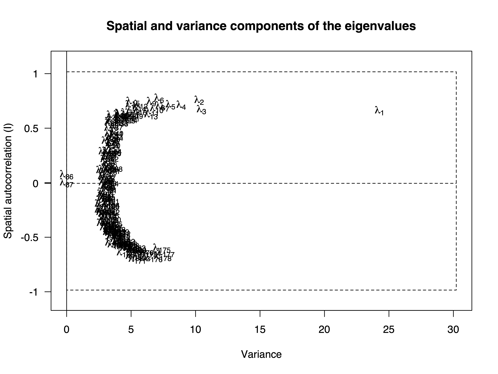

```{r setup, include=FALSE}
knitr::opts_chunk$set(echo = TRUE)
knitr::opts_chunk$set(message = FALSE)
knitr::opts_chunk$set(warning = FALSE)
knitr::opts_chunk$set(cache = FALSE)
```


```{r}
#Libraries
library(adegenet)
library(vcfR)
library(poppr)
library(ape)
library(viridis)
library(wordcloud)
library(sp)
library(rgdal)
library(spdep)
library(adespatial)
library(rgeos)
library(maps)
library(maptools)
library(ggplot2)
library(pals)
library(rcartocolor)
library(dbscan)
library(plotly)
library(gg3D)
library(akima)
library(vegan)
library(hierfstat)
library(pegas)
library(dplyr)
library(tidyr)
library(graph4lg)
library(raster)
library(groc)
library(qvalue)
library(conStruct)
library(fields)
library(gridExtra)
library(magick)
library(pdftools)
library(leaflet)
library(scatterplot3d)
library(ggfortify)
library(ggbiplot)
library(ggalt)
library(ggforce)
library(factoextra)
library(PCAtools)
```

```{r colors, include=FALSE}

#List of color hex codes used for figures

ECS_cols <- c("#D0FCFF", "#D2F2FD", "#59E0FE", "#85C1FE", 
              "#8CB3A6", "#4EC2CA", "#B097B1", "#B8C4D1", 
              "#B2B3E4", "#8882CD", "#C3AAFD", "#C8C9E3", 
              "#7C7B52", "#CBE7A5", "#6B8C47", "#B8C091", 
              "#BEFFBC", "#FEC3C3", "#FDFC84", "#FFFBCE", 
              "#FEC83C", "#9e9e9e", "#0a0a0a")

ECS_cols_1 <- c("#88CCEE", "#CC6677", "#DDCC77", "#117733",
                "#332288", "#AA4499", "#44AA99", "#999933",
                "#882255", "#661100", "#6699CC", "#888888",
                "#FAD3D6", "#FC9100", "#0DFEDE", "#2A6675",
                "#A6F587", "#FF91DE", "#B8EBEE", "#FC9B94",
                "#F25C56", "#9e9e9e")

ECS_cols_1.1 <- c("#88CCEE", "#CC6677", "#DDCC77", "#117733",
                "#332288", "#AA4499", "#44AA99", "#999933",
                "#882255", "#661100", "#6699CC", "#888888",
                "#FAD3D6", "#FC9100", "#0DFEDE", "#2A6675",
                "#A6F587", "#FF91DE", "#B8EBEE", "#FC9B94",
                "#F25C56", "#9e9e9e", "#0a0a0a")

quad_cols <- c("#882255", "#88CCEE", "#CC6677", "#332288")

quad_cols_1 <- c( "#0a0a0a", "#882255", "#88CCEE", "#CC6677", "#332288")
```

## Data structure

In this dataset there are 178 individuals - most samples are from MN and closely surrounding region, but there are also 2 samples from Finland that were excluded from analyses. Sampling was structured so that 1 individual was sequenced per population in order to maximize the landscape level sampling of populations. 

In total, there are 3690 independent loci of which 3071 are polymorphic and were retained for future analyses. 

# {.tabset .tabset-pills}

## Basic data attributes 
The vcf file was generated from a stacks population run on the aligned reads with SNPs called. We filtered loci to only retain those that were present in 70% of individuals globally, with maf >= 1%, and a maximum heterozygosity of 95%. Loci were written out with one random snp recorded per locus in order to avoid the issue of non-independent SNPs at a locus. All samples were sequenced for at least 60% of the loci with most missling only 10-20%.


```{r data}
#Once genotype data is read into R is must be converted into a genind object or other objects (e.g. genlight or genpop) to be useable by adegenet, adespatial, and poppr

#reading in vcf file
tansy_vcf <- read.vcfR("data/stacks_populations_output/populations.snps.vcf")
pops <- read.csv("data/tansy_pop_info_allsamples.csv")

#converting vcf data object into a genind object that is used in adegent and adespatial
tansy_genind <- vcfR2genind(tansy_vcf)
pop(tansy_genind) <- pops[,2]
ploidy(tansy_genind) <- 2
rownames(tansy_genind@tab) <- pops[,3]

#Fill NAs with mean allele frequency
tansy_tab <- tab(tansy_genind, NA.method = "mean")

#convert into other data objects that are used by poppr and adegenet/adespatial
tansy_genclone <- poppr::as.genclone(tansy_genind)
tansy_genlight <- vcfR2genlight(tansy_vcf)
tansy_genlight@ind.names <- pops[,3]
tansy_loci <- vcfR2loci(tansy_vcf)
tansy_genpop <- genind2genpop(tansy_genind, quiet = TRUE)

```

## Population geography {.tabset .tabset-pills}
Most populations (n = 176) were chosen to span the entire distribution of Common tansy throughout the state of Minnesota. Common tansy is much more common in the northern half of the state, which is reflected in our sampling design. In the southern portion of the state, we attempted to collect plant tissue from as many reported populations as possible.

In the analysis, we assigned each population to a geographical grouping (n = 14 in MN + 1 Finland) as indicated by the colors in the map. Groupings were meant to cluster populations that were similar in geography and ecology.
```{r geography, eval=TRUE}
#Plot of sites (mostly MN)

#Read in coordinates
xy <- pops[,5:6] #lat/lon of each of the populations in the dataset
coordinates(xy) <- ~ lon + lat
proj4string(xy) <- CRS("+proj=longlat +ellps=WGS84 +no_defs")


pops$geo_grp <- as.factor(pops$geo_grp)
pops$ECS_fac2 <- as.factor(pops$ECS_fac2)
pops$MN_quad <- as.factor(pops$MN_quad)
pops_df <- pops
coordinates(pops) <- ~ lon + lat
proj4string(pops) <- CRS("+proj=longlat +ellps=WGS84 +no_defs")

```


```{r USsamps}
#For use in population level stats where Finland is removed
tansy_genind_pop <- tansy_genind
tansy_genind_pop$other$xy <- xy@coords

nums <- seq(1:178)
fin_pops <- grep("FINLAND", pops_df$name)
MN_which <- which(nums!=fin_pops)
MN_pops <-MN_which

xy_MN <- as_tibble(xy@coords[MN_pops,])
xy_MN$ID <- MN_pops
coordinates(xy_MN) <- ~ lon + lat
proj4string(xy_MN) <- CRS("+proj=longlat +ellps=WGS84 +no_defs")

tansy_genind_pop_MN <- tansy_genind_pop[MN_pops,]
tansy_genpop_pop_MN <- genind2genpop(tansy_genind_pop_MN, quiet = TRUE)

```

### Ecological Classification Subsections
The MN Department of Natural Resources has divided the state using the Ecological Classification System using the National Hierarchical Framework of Ecological Units ([ECS website](https://www.dnr.state.mn.us/ecs/index.html)). 

>  Ecological land classifications are used to identify, describe, and map progressively smaller areas of land with increasingly uniform ecological features. The system uses associations of biotic and environmental factors, including climate, geology, topography, soils, hydrology, and vegetation.

```{r ECS_MN, echo=FALSE, fig.align='center'}

knitr::include_graphics("figures/MN ecoregion subsections.png")

```

### MN Tansy populations
```{r geoPlotsMN, cache=FALSE}
#colstring = transp(glasbey()[5:28], 0.95)
colstring = transp(stepped(23), 0.95)
pops_dfMN <- pops_df[pops_df[,4]!=14,]

midwest <- map_data("county", "minnesota")
midwest <- midwest[midwest$long > -100 & midwest$long < -89.5 &
                         midwest$lat > 41 & midwest$lat < 52,]

MNsites_ecoregion_cols <- ggplot() + geom_path(data = midwest, mapping = aes(x = long, y = lat, group = group), color = "gray") +
  geom_point(data = pops_dfMN, mapping = aes(x = lon, y = lat, col = ECS_SUBSEC, group = name), cex = 3) +
  scale_color_manual(values = ECS_cols_1) +
  coord_fixed(ratio = 1.5) +
  theme_bw()

ggplotly(MNsites_ecoregion_cols)


MNsites_quad_cols <- ggplot() + geom_path(data = midwest, mapping = aes(x = long, y = lat, group = group), color = "gray") +
  geom_point(data = pops_dfMN, mapping = aes(x = lon, y = lat, col = MN_quad, group = name), cex = 3) +
  scale_color_manual(values = quad_cols) +
  coord_fixed(ratio = 1.5) +
  theme_bw()

ggplotly(MNsites_quad_cols)
```

## SNP data exploration {.tabset .tabset-pills}

The allele frequencies of the loci are consistent with expectation for neutral loci. 

### Alleles by locus

All alleles for all loci are shown indexed by each individual in the analysis. We eliminated loci that had a maf =< 1% and that had maximum heterozyosity greater than 95%. A few loci remain that are nearly all heterozygous, but not in all populations.

```{r AlleleFreqPlot}

#plotting of genlight data object to see alleles for each loci indexed by all individuals

tansy_glPlot <- glPlot(tansy_genlight, col = viridis(3), posi = "topright")

```

### Allele Frequency Spectrum

The allele frequency spectrum follows the theoretical distribution for neutral loci. Most alleles are segregating at very low frequency (0.01 < maf < 0.1).
```{r AllelFreqSpectrum}
#Allele frequency to get an allele frequency spectrum

tansy_allele_freq <- glMean(tansy_genlight)

hist(tansy_allele_freq, proba = TRUE, breaks = 20, col = "gold", ylim = c(0, 20), xlab = "Allele Frequencies", main = "Distribution of (second) allele frequencies")
temp <- density(tansy_allele_freq)
lines(temp$x, temp$y, lwd=3)
```

# Landscape genomic analysis {.tabset .tabset-pills}

## Isolation-by-distance {.tabset .tabset-pills}

### IBD graph and test
```{r ibd_2}

tansy_Dgen_MN <- dist.genpop(tansy_genpop_pop_MN, method = 1) #Distance calculated as Nei's Distance
tansy_Dgeo_MN <- rdist.earth(tansy_genind_pop_MN$other$xy)
tansy_Dgeo_MN <- as.dist(tansy_Dgeo_MN)

tansy_ibd_MN <- mantel.randtest(tansy_Dgen_MN, tansy_Dgeo_MN)
tansy_ibd_MN

tansy_Dgen_MN_mat <- as.matrix(tansy_Dgen_MN)
tansy_Dgeo_MN_mat <- as.matrix(tansy_Dgeo_MN)

tansy_Dgen_MN_mat_2 <- mat_gen_dist(tansy_genind_pop_MN)
tansy_Dgeo_MN_mat_2 <- mat_geo_dist(xy_MN, ID = "ID", crds_type = 'polar')

col.order <- colnames(tansy_Dgen_MN_mat_2)
row.order <- rownames(tansy_Dgen_MN_mat_2)

tansy_Dgeo_MN_mat_2_1 <- tansy_Dgeo_MN_mat_2[,col.order]
tansy_Dgeo_MN_mat_2_2 <- tansy_Dgeo_MN_mat_2_1[row.order,]

#scatter_dist(tansy_Dgen_MN_mat, tansy_Dgeo_MN_mat)
scatter_dist(tansy_Dgen_MN_mat, tansy_Dgeo_MN_mat)
```

### Correlation by Distance
```{r ibd_3}
tansy_dist_max <- dist_max_corr(tansy_Dgen_MN_mat_2, tansy_Dgeo_MN_mat_2_2, interv = 1000)
paste(sprintf("The max correlation happens at %.2f km", max(tansy_dist_max$`distance at which correlation reaches a maximum`)/1000))
paste(sprintf("The max correlation value was %.4f",  max(tansy_dist_max$`correlation coefficients`, na.rm = T)))
```

## Principal Components Analysis {.tabset .tabset-pills}

Principal Components Analysis of the full genomic dataset.

```{r}
#Eliminate the duplicated samples from dataset (STL002-2 sample for was a duplicate of STL002-1 so was removed; Finland samples were removed)

pops_df_duprm <- pops_df[rownames(pops_df)!=131,] 

pops_df_duprm <- pops_df_duprm[rownames(pops_df_duprm)!=51,]
pops_df_duprm <- pops_df_duprm[rownames(pops_df_duprm)!=52,]

#Remake the Spatial points object with duplicate removed
xy_duprm <- pops_df_duprm[,5:6] #lat/lon of each of the populations in the dataset
coordinates(xy_duprm) <- ~ lon + lat
proj4string(xy_duprm) <- CRS("+proj=longlat +ellps=WGS84 +no_defs")


```


```{r}
#Removing duplicated populations and Finland populations from the dataframe
tansy_df <- genind2df(tansy_genind, sep = "/")
tansy_df_rmdup <- tansy_df[row.names(tansy_df)!="STL002-2",]
tansy_df_rmdup <- tansy_df_rmdup[row.names(tansy_df_rmdup)!="FINLAND1",]
tansy_df_rmdup <- tansy_df_rmdup[row.names(tansy_df_rmdup)!="FINLAND2",]


#Filling the datafile to allow for PCA
tansy_genind_rmdup <- df2genind(tansy_df_rmdup[,2:ncol(tansy_df_rmdup)], ploidy = 2, sep = "/")
pop(tansy_genind_rmdup) <- pops_df_duprm[,2]
tansy_genind_rmdup_full <- missingno(tansy_genind_rmdup, type = "mean")
tansy_tab_MN <- tansy_genind_rmdup_full@tab

#Removing duplicates from the table of alleles for later testing
tansy_tab_duprm <- tansy_tab[rownames(tansy_tab)!="STL002-2",]
tansy_tab_duprm <- tansy_tab_duprm[rownames(tansy_tab_duprm)!="FINLAND1",]
tansy_tab_duprm <- tansy_tab_duprm[rownames(tansy_tab_duprm)!="FINLAND2",]

```

```{r pca}


pca.MN <- dudi.pca(tansy_tab_MN, scannf = FALSE, scale = FALSE, nf = 3)

pca_1 <- pca.MN$li[,1]
pca_2 <- pca.MN$li[,2]
pca_3 <- pca.MN$li[,3]

```

### PCA biplot
Populations plotted in PCA space. Color refers to different geographical groupings.
```{r PCAplot}
pca_df <- data.frame(cbind(pops_df_duprm, pca.MN$li))

temp <- as.integer(as.factor(pops@data$ECS_SUBSEC))
myCol <- transp(ECS_cols, 0.7)[temp]
myCol2 <- ECS_cols[temp]
col_fac_order <- order(pca_df$ECS_SUBSEC)
new_myCol2 <- myCol2[col_fac_order]


tansy_pca_plot <- ggplot(data = pca_df) + geom_point(mapping = aes(x = Axis1, y = Axis2, col = ECS_SUBSEC, group = name), cex = 4) +
  scale_color_manual(values = ECS_cols_1.1) +
  theme_bw()

ggplotly(tansy_pca_plot)

tansy_pca_plot_2_3 <- ggplot(data = pca_df) + geom_point(mapping = aes(x = Axis3, y = Axis2, col = ECS_SUBSEC, group = name), cex = 4) +
  scale_color_manual(values = ECS_cols_1.1) +
  theme_bw()

ggplotly(tansy_pca_plot_2_3)


tansy_pca_plot_1 <- ggplot(data = pca_df) + geom_point(mapping = aes(x = Axis1, y = Axis2, col = MN_quad, group = name), cex = 4) +
  scale_color_manual(values = quad_cols) +
  theme_bw()

ggplotly(tansy_pca_plot_1)

tansy_pca_plot_2 <- ggplot(data = pca_df) + geom_point(mapping = aes(x = Axis3, y = Axis2, col = MN_quad, group = name), cex = 4) +
  scale_color_manual(values = quad_cols) +
  theme_bw()

ggplotly(tansy_pca_plot_2)


```

### PCA Map
Map pf populations with values colors representing values for PCA1

```{r PCAmap}


MNpca1 <- ggplot() + geom_path(data = midwest, mapping = aes(x = long, y = lat, group = group), color = "black") +
  geom_point(data = pca_df, mapping = aes(x = lon, y = lat, col = Axis1, group = name), cex = 3) +
  scale_color_viridis_c(option = "E") +
  coord_fixed(ratio = 1.5) +
  theme_bw()

ggplotly(MNpca1)


MNpca2 <- ggplot() + geom_path(data = midwest, mapping = aes(x = long, y = lat, group = group), color = "black") +
  geom_point(data = pca_df, mapping = aes(x = lon, y = lat, col = Axis2), cex = 3) +
  scale_color_viridis_c(option = "E") +
  coord_fixed(ratio = 1.5) +
  theme_bw()

ggplotly(MNpca2)

```

## Spatial Principal Components Analysis  {.tabset .tabset-pills}

### Neighborhood Weight Matix
```{r}
tansy_tri_delaunay <- tri2nb(xy_duprm) #Delaunay Triangulation diagram
tansy_tri_gabriel <- graph2nb(gabrielneigh(xy_duprm@coords), sym = TRUE) # Gabriel neighborhoods graph
gabriel_listw <- nb2listw(tansy_tri_gabriel)  

plot(diffnb(tansy_tri_delaunay, tansy_tri_gabriel, verbose = FALSE), xy_duprm@coords, pch = ".", lty = 2, col = "grey60", xlim = c(-95, -91), ylim = c(43, 50))
plot(tansy_tri_gabriel, xy_duprm@coords,  pch = 19, cex = 0.25, lwd = 2, add = TRUE)
```

### SPCA
```{r spca, cache=TRUE}

#Creating sPCA object 

#adegent sPCA method
tansy_gabriel_spca_1<-spca(tansy_genind_rmdup_full, xy = xy_duprm@coords, cn = tansy_tri_gabriel, ask=F, scannf=F, nfposi = 3, nfnega = 3)
#summary of spca
tansy_gabriel_spca_1_summary <- summary(tansy_gabriel_spca_1)

```

### sPCA Eigenvalues
We retained the first 3 positively correlated axes and the last 3 negatively correlated axes for further investigation. Positively correlated axes describe global structure whereas negatively correlated axes describe local structure.
```{r eigenvalues}

retained <- rep(c("#882255", "grey70", "#88CCEE"), c(3,170,3))
barplot(tansy_gabriel_spca_1$eig, main = "Eigenvalues of sPCA", col = retained)

```

### sPCA Screeplot

```{r screeplot_fig, eval=FALSE, include=FALSE}

#Make screeplot - takes a really long time
screeplot(tansy_gabriel_spca_1)

```

```{r screeplot_img, echo=FALSE, fig.align='center'}


```


### sPCA tests{.tabset}

#### Global test

Randomization test indicates that there is more global spatial structure than would be expected when compared to randomized data.
```{r sPCA_Gtests}
tansy_Gtest <- global.rtest(tansy_tab_duprm, tansy_gabriel_spca_1$lw, nperm = 999)
tansy_Gtest
plot(tansy_Gtest)

```

#### Local test

There is no significant local spatial structuring of genetic variation.
```{r sPCA_Ltests}
tansy_Ltest <- local.rtest(tansy_tab_duprm, tansy_gabriel_spca_1$lw, nperm = 999)
tansy_Ltest
plot(tansy_Ltest)

```

### sPCA Biplot
sPCA plot when using a Gabriel's graph for the neighborhood object. Using a sphere of influence neighborhood graph or a neighborhood that only includes the two nearest neighbors is very similar both quantitatively and qualitatively. Global structure indicates that there is differentiation in the NW region of the state (along Axis 1) and on a East-West gradient in the NE portion of the state (along Axis 2).
```{r SPCAplot}

spca_df <- data.frame(cbind(pops_df_duprm, tansy_gabriel_spca_1$ls))

tansy_spca_plot_1_eco <- ggplot(data = spca_df) + geom_point(mapping = aes(x = Axis.1, y = Axis.2, col = ECS_SUBSEC, group = name), cex = 4) +
  scale_color_manual(values = ECS_cols_1.1) +
  theme_bw()

ggplotly(tansy_spca_plot_1_eco)

tansy_spca_plot_1_quad <- ggplot(data = spca_df) + geom_point(mapping = aes(x = Axis.1, y = Axis.2, col = MN_quad, group = name), cex = 4) +
  scale_color_manual(values = quad_cols) +
  theme_bw()

ggplotly(tansy_spca_plot_1_quad)


tansy_spca_plot_2_eco <- ggplot(data = spca_df) + geom_point(mapping = aes(x = Axis.1, y = Axis.3, col = ECS_SUBSEC, group = name), cex = 4) +
  scale_color_manual(values = ECS_cols_1.1) +
  theme_bw()

ggplotly(tansy_spca_plot_2_eco)

tansy_spca_plot_2_quad <- ggplot(data = spca_df) + geom_point(mapping = aes(x = Axis.1, y = Axis.3, col = MN_quad, group = name), cex = 4) +
  scale_color_manual(values = quad_cols) +
  theme_bw()

ggplotly(tansy_spca_plot_2_quad)


tansy_spca_plot_3_eco <- ggplot(data = spca_df) + geom_point(mapping = aes(x = Axis.2, y = Axis.3, col = ECS_SUBSEC, group = name), cex = 4) +
  scale_color_manual(values = ECS_cols_1.1) +
  theme_bw()

ggplotly(tansy_spca_plot_3_eco)


tansy_spca_plot_3_quad <- ggplot(data = spca_df) + geom_point(mapping = aes(x = Axis.2, y = Axis.3, col = MN_quad, group = name), cex = 4) +
  scale_color_manual(values = quad_cols) +
  theme_bw()

ggplotly(tansy_spca_plot_3_quad)


```

### Loadings

```{r sPCA_loadings}
myLoadings <- tansy_gabriel_spca_1$c1[,1]^2
names(myLoadings) <- rownames(tansy_gabriel_spca_1$c1)
loadingplot(myLoadings, xlab="Alleles", ylab="Weight of the alleles", main="Contribution of alleles \n to the first sPCA axis")
```


### sPCA Map

```{r MNmap_gabriel}

#Using the output 


MNspca_axis1 <- ggplot() + geom_path(data = midwest, mapping = aes(x = long, y = lat, group = group), color = "gray20") +
  geom_point(data = spca_df, mapping = aes(x = lon, y = lat, col = Axis.1, group = name), size = 3) +
  scale_color_viridis_c(option = "E") +
  coord_fixed(ratio = 1.5) +
  theme_bw()

ggplotly(MNspca_axis1)

MNspca_axis2 <- ggplot() + geom_path(data = midwest, mapping = aes(x = long, y = lat, group = group), color = "gray20") +
  geom_point(data = spca_df, mapping = aes(x = lon, y = lat, col = Axis.2, group = name), size = 3) +
  scale_color_viridis_c(option = "E") +
  coord_fixed(ratio = 1.5) +
  theme_bw()

ggplotly(MNspca_axis2)

```


## fineRADstructure {.tabset .tabset-pills}

The coancestry matix indicates that there are two main clusters and within those clusters there are three clades.

```{r, eval=FALSE}
source("scripts/fineRADstructure/fineRADstructurePlot_mod.R")
#Data obtained by running fineRADstructure (e.g. RADpainter followed by finestructure - follow instructions at https://github.com/millanek/fineRADstructure and https://www.milan-malinsky.org/fineradstructure) on the commandline and then output files imported into the data/fineRADstructureOutputs (.out, .mcmc.xml, .mcmcTree.xml files)
```

### Coancestry matrix
```{r fineRADStructure,echo=FALSE}
#knitr::include_graphics("figures/fineRADstructure/tansy_pops_fineRADpainter_35_reorder-PopAveragedCoancestry2.pdf")
coancestry <- magick::image_read("figures/tansy_pops_fineRADpainter_35_reorder-PopAveragedCoancestry2.pdf")

coan <- c(coancestry)
image_append(image_scale(coan, "x1000"))
```


## conStruct {.tabset .tabset-pills}

```{r, eval = FALSE}
#Read in appropriate data

# 3 datasets needed to run conStruct

#Biallelic allele frequency matrix for MN tansy populations
#Allelic Data in STRUCTURE format (with 2 rows/individual) read in and converted to conStruct allelic matrix

tansyMN_allelefreq_mat <- structure2conStruct(infile = "genodive_out/tansy_MN_pops_struct_nohead.str",
                                              onerowperind = FALSE,
                                              start.loci = 3,
                                              start.sample = 1,
                                              missing.datum = 0,
                                              outfile = "tansy_MNpops_conStruct_2")
 


# Matrix of Lon/Lat coordinates for MN tansy sites
tansyMN_coords <- xy_MN@coords

# Geographic distance matrix (calculated using great circle distances)
tansyMN_geodist <- fields::rdist.earth(tansyMN_coords)
```

### Spatial conStruct {.tabset}
```{r, eval=FALSE}

#Spatial conStruct analyses

tansy_spatial_k1 <- conStruct(spatial = TRUE,
                              K = 1,
                              freqs = tansyMN_allelefreq_mat,
                              geoDist = tansyMN_geodist,
                              coords = tansyMN_coords,
                              prefix = "spK1")

tansy_spatial_k2 <- conStruct(spatial = TRUE,
                              K = 2,
                              freqs = tansyMN_allelefreq_mat,
                              geoDist = tansyMN_geodist,
                              coords = tansyMN_coords,
                              prefix = "spK2")

tansy_spatial_k3 <- conStruct(spatial = TRUE,
                              K = 3,
                              freqs = tansyMN_allelefreq_mat,
                              geoDist = tansyMN_geodist,
                              coords = tansyMN_coords,
                              prefix = "spK3")

tansy_spatial_k4 <- conStruct(spatial = TRUE,
                              K = 4,
                              freqs = tansyMN_allelefreq_mat,
                              geoDist = tansyMN_geodist,
                              coords = tansyMN_coords,
                              prefix = "spK4")

tansy_spatial_k5 <- conStruct(spatial = TRUE,
                              K = 5,
                              freqs = tansyMN_allelefreq_mat,
                              geoDist = tansyMN_geodist,
                              coords = tansyMN_coords,
                              prefix = "spK5")

tansy_spatial_k6 <- conStruct(spatial = TRUE,
                              K = 6,
                              freqs = tansyMN_allelefreq_mat,
                              geoDist = tansyMN_geodist,
                              coords = tansyMN_coords,
                              prefix = "spK6")

```

#### K = 2
```{r}
struct2 <- magick::image_read("conStruct/spatial/spK2_250K_structure.plot.chain_1.pdf")
pie2 <- magick::image_read("conStruct/spatial/spK2_250K_pie.map.chain_1.pdf")

conStructK2 <- c(struct2, pie2)
image_append(image_scale(conStructK2, "x500"))
```

#### K = 3

```{r}
struct3 <- magick::image_read("conStruct/spatial/spK3_250K_structure.plot.chain_1.pdf")
pie3 <- magick::image_read("conStruct/spatial/spK3_250K_pie.map.chain_1.pdf")

conStructK3 <- c(struct3, pie3)
image_append(image_scale(conStructK3, "x500"))
```

#### K = 4

```{r}
struct4 <- magick::image_read("conStruct/spatial/spK4_250K_structure.plot.chain_1.pdf")
pie4 <- magick::image_read("conStruct/spatial/spK4_250K_pie.map.chain_1.pdf")

conStructK4 <- c(struct4, pie4)
image_append(image_scale(conStructK4, "x500"))
```

#### K = 5

```{r}
struct5 <- magick::image_read("conStruct/spatial/spK5_250K_structure.plot.chain_1.pdf")
pie5 <- magick::image_read("conStruct/spatial/spK5_250K_pie.map.chain_1.pdf")

conStructK5 <- c(struct5, pie5)
image_append(image_scale(conStructK5, "x500"))
```

#### K = 6

```{r}
struct6 <- magick::image_read("conStruct/spatial/spK6_250K_structure.plot.chain_1.pdf")
pie6 <- magick::image_read("conStruct/spatial/spK6_250K_pie.map.chain_1.pdf")

conStructK6 <- c(struct6, pie6)
image_append(image_scale(conStructK6, "x500"))
```

#### Layer contribution
```{r}


layer.contributions <- matrix(NA,nrow=6,ncol=6)

# load the conStruct.results.Robj and data.block.Robj
#   files saved at the end of a conStruct run
load("conStruct/spatial/spK1_250K_conStruct.results.Robj")
load("conStruct/spatial/spK1_250K_data.block.Robj")

# calculate layer contributions
layer.contributions[,1] <- c(calculate.layer.contribution(conStruct.results[[1]],data.block),rep(0,5))
tmp <- conStruct.results[[1]]$MAP$admix.proportions

for(i in 2:6){
    # load the conStruct.results.Robj and data.block.Robj
    #   files saved at the end of a conStruct run
    load(sprintf("conStruct/spatial/spK%s_250K_conStruct.results.Robj",i))
    load(sprintf("conStruct/spatial/spK%s_250K_data.block.Robj",i))
    
    # match layers up across runs to keep plotting colors consistent
    #   for the same layers in different runs
    tmp.order <- match.layers.x.runs(tmp,conStruct.results[[1]]$MAP$admix.proportions)  

    # calculate layer contributions
    layer.contributions[,i] <- c(calculate.layer.contribution(conStruct.results=conStruct.results[[1]],
                                                             data.block=data.block,
                                                             layer.order=tmp.order),
                                    rep(0,6-i))
    tmp <- conStruct.results[[1]]$MAP$admix.proportions[,tmp.order]
}


lc <- as_tibble(layer.contributions)
colnames(lc) <- c("k1", "k2", "k3", "k4", "k5", "k6")
lc$layer <- as.factor(seq(1,6))

lc_long <- pivot_longer(lc, cols = (1:6), names_to = "colname", values_to = "contrib")

K <- c(rep(1, 6), rep(2,6), rep(3, 6), rep(4,6), rep(5,6), rep(6,6))

stacked_lc <- ggplot(data = lc_long, aes(x = colname, y = contrib)) + 
  geom_bar(aes(fill = layer), stat = "identity") +
  theme_bw()

stacked_lc

# {cairo_pdf(filename = "figures/conStruct_layer_contrib.pdf", height = 6, width = 8)
#   stacked_lc
#   }
# dev.off()
```

### Non-spatial conStruct {.tabset}
```{r, eval=FALSE}

#non-Spatial conStruct analyses

tansy_nonspatial_k1 <- conStruct(spatial = FALSE,
                              K = 1,
                              freqs = tansyMN_allelefreq_mat,
                              geoDist = tansyMN_geodist,
                              coords = tansyMN_coords,
                              prefix = "nonspK1")

tansy_nonspatial_k2 <- conStruct(spatial = FALSE,
                              K = 2,
                              freqs = tansyMN_allelefreq_mat,
                              geoDist = tansyMN_geodist,
                              coords = tansyMN_coords,
                              prefix = "nonspK2")

tansy_nonspatial_k3 <- conStruct(spatial = FALSE,
                              K = 3,
                              freqs = tansyMN_allelefreq_mat,
                              geoDist = tansyMN_geodist,
                              coords = tansyMN_coords,
                              prefix = "nonspK3")

tansy_nonspatial_k4 <- conStruct(spatial = FALSE,
                              K = 4,
                              freqs = tansyMN_allelefreq_mat,
                              geoDist = tansyMN_geodist,
                              coords = tansyMN_coords,
                              prefix = "nonspK4")

tansy_nonspatial_k5 <- conStruct(spatial = FALSE,
                              K = 5,
                              freqs = tansyMN_allelefreq_mat,
                              geoDist = tansyMN_geodist,
                              coords = tansyMN_coords,
                              prefix = "nonspK5")

tansy_nonspatial_k6 <- conStruct(spatial = FALSE,
                              K = 6,
                              freqs = tansyMN_allelefreq_mat,
                              geoDist = tansyMN_geodist,
                              coords = tansyMN_coords,
                              prefix = "nonspK6")

```

#### K = 2
```{r}
struct2 <- magick::image_read("conStruct/nonspatial/nspK2_250K_structure.plot.chain_1.pdf")
#struct2_rot <- image_rotate(struct2, 270)
pie2 <- magick::image_read("conStruct/nonspatial/nspK2_250K_pie.map.chain_1.pdf")

conStructK2 <- c(struct2, pie2)
image_append(image_scale(conStructK2, "x500"))
```

#### K = 3

```{r}
struct3 <- magick::image_read("conStruct/nonspatial/nspK3_250K_structure.plot.chain_1.pdf")
pie3 <- magick::image_read("conStruct/nonspatial/nspK3_250K_pie.map.chain_1.pdf")

conStructK3 <- c(struct3, pie3)
image_append(image_scale(conStructK3, "x500"))
```

#### K = 4

```{r}
struct4 <- magick::image_read("conStruct/nonspatial/nspK4_250K_structure.plot.chain_1.pdf")
pie4 <- magick::image_read("conStruct/nonspatial/nspK4_250K_pie.map.chain_1.pdf")

conStructK4 <- c(struct4, pie4)
image_append(image_scale(conStructK4, "x500"))
```

#### K = 5

```{r}
struct5 <- magick::image_read("conStruct/nonspatial/nspK5_250K_structure.plot.chain_1.pdf")
pie5 <- magick::image_read("conStruct/nonspatial/nspK5_250K_pie.map.chain_1.pdf")

conStructK5 <- c(struct5, pie5)
image_append(image_scale(conStructK5, "x500"))
```

#### K = 6

```{r}
struct6 <- magick::image_read("conStruct/nonspatial/nspK6_250K_structure.plot.chain_1.pdf")
pie6 <- magick::image_read("conStruct/nonspatial/nspK6_250K_pie.map.chain_1.pdf")

conStructK6 <- c(struct6, pie6)
image_append(image_scale(conStructK6, "x500"))
```

#### Layer contribution
```{r}
layer.contributions <- matrix(NA,nrow=6,ncol=6)

# load the conStruct.results.Robj and data.block.Robj
#   files saved at the end of a conStruct run
load("conStruct/nonspatial/nspK1_250K_conStruct.results.Robj")
load("conStruct/nonspatial/nspK1_250K_data.block.Robj")

# calculate layer contributions
layer.contributions[,1] <- c(calculate.layer.contribution(conStruct.results[[1]],data.block),rep(0,5))
tmp <- conStruct.results[[1]]$MAP$admix.proportions

for(i in 2:6){
    # load the conStruct.results.Robj and data.block.Robj
    #   files saved at the end of a conStruct run
    load(sprintf("conStruct/nonspatial/nspK%s_250K_conStruct.results.Robj",i))
    load(sprintf("conStruct/nonspatial/nspK%s_250K_data.block.Robj",i))
    
    # match layers up across runs to keep plotting colors consistent
    #   for the same layers in different runs
    tmp.order <- match.layers.x.runs(tmp,conStruct.results[[1]]$MAP$admix.proportions)  

    # calculate layer contributions
    layer.contributions[,i] <- c(calculate.layer.contribution(conStruct.results=conStruct.results[[1]],
                                                             data.block=data.block,
                                                             layer.order=tmp.order),
                                    rep(0,6-i))
    tmp <- conStruct.results[[1]]$MAP$admix.proportions[,tmp.order]
}


lc <- as_tibble(layer.contributions)
colnames(lc) <- c("k1", "k2", "k3", "k4", "k5", "k6")
lc$layer <- as.factor(seq(1,6))

lc_long <- pivot_longer(lc, cols = (1:6), names_to = "colname", values_to = "contrib")

K <- c(rep(1, 6), rep(2,6), rep(3, 6), rep(4,6), rep(5,6), rep(6,6))

stacked_lc <- ggplot(data = lc_long, aes(x = colname, y = contrib)) + 
  geom_bar(aes(fill = layer), stat = "identity") +
  theme_bw()

stacked_lc

# {cairo_pdf(filename = "figures/conStruct_layer_contrib_nonspatial.pdf", height = 6, width = 8)
#   stacked_lc
#   }
# dev.off()

```

## Fast Estimated Effective Migration Surfaces (feems)
```{r}

#Analysis was conducted in python - see jupyter notebook file in script folder for code and information

grid <- magick::image_read("feems/screen_cap_figs/feems_grid_100kmsq.png")
#struct2_rot <- image_rotate(struct2, 270)
feems_20 <- magick::image_read("feems/screen_cap_figs/feems_model_lambda20_smooth.png")
feems_2 <- magick::image_read("feems/screen_cap_figs/feems_model_lambda2_moderate.png")

feems_panels <- c(grid, feems_20, feems_2)
image_append(image_scale(feems_panels, "x500"))

```


